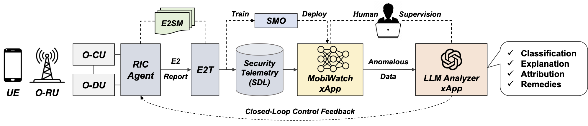

# MobiWatch

MobiWatch is an O-RAN compliant xApp that employs unsupervised unsupervised deep learning to detect layer-3 (RRC and NAS) cellular anomalies and attacks in 5G networks.

For more design details, please refer to our HotNets'24 research paper [6G-XSec: Explainable Edge Security for Emerging OpenRAN Architectures](). 

Currently it is compatible with two nRT-RIC implmentation: OSC RIC and SD-RAN ONOS RIC.



## Prerequisite

### Local Docker registry

MobiWatch is built from source as a local Docker container. Refer to the official tutorial (https://docs.docker.com/engine/install/) to install and set up the Docker environment.

Create a local docker registry to host docker images: 

```
sudo docker run -d -p 5000:5000 --restart=always --name registry registry:2
```

### OSC nRT RIC

Before deploying the xApp, make sure the OSC nRT-RIC is deployed by following this [tutorial](https://github.com/5GSEC/5G-Spector/wiki/O%E2%80%90RAN-SC-RIC-Deployment-Guide#deploy-the-osc-near-rt-ric).


### MobiFlow Auditor xApp

MobiWatch directly acquires security telemetry from the SDL generated from the [MobiFlow Auditor xApp](https://github.com/5GSEC/MobiFlow-Auditor) xApp. Following the instructions to prepare the environment and collect data from a 5G network.


## Build

Run the build script:

```
./build.sh
```


## Install / Uninstall the xApp

First, onboard the xApp. You need to set up the proper environment with the `dms_cli` tool. Follow the instructions [here](https://github.com/5GSEC/5G-Spector/wiki/O%E2%80%90RAN-SC-RIC-Deployment-Guide) to install the tool. 

Then execute the following to onboard the xApp:

```
cd init
sudo -E dms_cli onboard --config_file_path=config-file.json --shcema_file_path=schema.json
```

Then, simply run the script to deploy the xApp under the `ricxapp` K8S namespace in the nRT-RIC.

```
cd ..
./deploy.sh
```

Successful deployment (this may take a while):

```
$ kubectl get pods -n ricxapp
ricxapp        ricxapp-mobiwatch-xapp-6b8879868d-fmnbd                      1/1     Running     0             5m32s
```


To uninstall MobiWatch from the Kubernetes cluster:

```
./undeploy.sh
```

## Running Example

MobiWatch's classification results with benign 5G network traffic:

```
[INFO 2024-10-23 21:42:23,990 dlagent.py:222]
    rnti        tmsi                     msg
0  60786  1450744508         RRCSetupRequest
1  60786  1450744508                RRCSetup
2  60786  1450744508        RRCSetupComplete
3  60786  1450744508     Registrationrequest
4  60786  1450744508   Authenticationrequest
5  60786  1450744508  Authenticationresponse
[INFO 2024-10-23 21:42:23,990 dlagent.py:223] Benign


[INFO 2024-10-23 21:42:23,993 dlagent.py:222]
    rnti        tmsi                     msg
1  60786  1450744508                RRCSetup
2  60786  1450744508        RRCSetupComplete
3  60786  1450744508     Registrationrequest
4  60786  1450744508   Authenticationrequest
5  60786  1450744508  Authenticationresponse
6  60786  1450744508     Securitymodecommand
[INFO 2024-10-23 21:42:23,993 dlagent.py:223] Benign
```


## Dataset

Datasets used for training the DL model are available in this [folder](./src/ai/autoencoder/data). The `.csv` files are converted from the `.pcap` data traffic in this [folder](./src/ai/autoencoder/data)

## Model Training

MobiWatch includes pre-trained DL models on benign layer-3 5G network traffic. 

was trained using the Pytorch


## Publication

Please cite our research papers if you develop any products and prototypes based on our code and datasets:

```
@inproceedings{6G-XSEC:Hotnets24,
  title     = {6G-XSec: Explainable Edge Security for Emerging OpenRAN Architectures },
  author    = {Wen, Haohuang and Sharma, Prakhar and Yegneswaran, Vinod and Porras, Phillip and Gehani, Ashish and Lin, Zhiqiang},
  booktitle = {Proceedings of the Twenty-Third ACM Workshop on Hot Topics in Networks (HotNets 2024)},
  address   = {Irvine, CA},
  month     = {November},
  year      = 2024
}
```